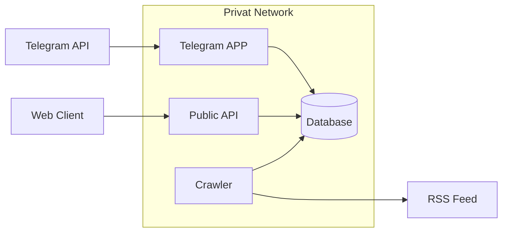

# hoba-hoba

Hoba bot by Hoba podcast

# Architecture

## model:

collection format: 
```yaml
Content:
    uuid: uuid
    
    data:
        name: str 
        title: str
    
    feed:
        url: str

    admins:
      - uuid: uuid
        telegram_id: int64
        is_owner: bool
  
    publish:
      - telegram_id: int64

    crawler:
        time: datetime 
        index: str

Item:
    uuid: uuid 
    content_uuid: -> Content
    
    data:
        name: str
        title: str
        text: str
        url: str
        datetime: datetime
    
    state:
        telegram: bool
```

## app


